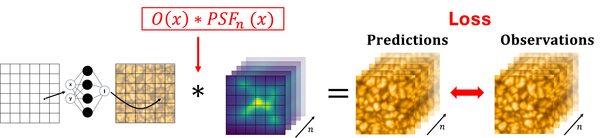

# Neural Blind Deconvolution - NeuralBD

Large aperture ground-based solar telescope are affected by Earth's turbulent atmosphere. While adaptive optics systems are able to compensate for some of these effects, post-facto image reconstruction techniques are required to reach the diffraction limit of the telescope. 

`NeuralBD` is a blind deconvolution method based on physics-informed neural networks (PINNs) that is able to reconstruct a short-exposure image burst, degraded by atmospheric turbulence. The method can estimate the true object intensity distribution as well as the point spread functions (PSFs), simultaneously. By incorporating the image formation process into the training of the neural network, `NeuralBD` is able to recover high-quality observations without the need for paired training data.


## Installation
To install the `NeuralBD` tool we recommend to use the latest version with the following command:
``` pip install git+
pip install git+https://github.com/RobertJaro/NeuralBD.git
```


## Usage
`NeuralBD` can be used to reconstruct high-resolution solar observations from short-exposure bursts. The method is implemented in Python and uses [wandb](https://wandb.ai/site/) for logging the reconstruction process. To perform the reconstructions, the configuration files can be used.

### Example Configuration File
```yaml
base_dir: <<PATH TO SAVE THE RESULTS>>
meta_state: 'none' # State of meta-learning, options: 'none', 'pretrain'
data:
  type: 'GREGOR'
  data_path: <<PATH TO SAVE THE DATA>>
  n_images: <<NUMBER OF IMAGES TO USE>>
  pixel_per_ds: 511.5 # Model conversion
  x_crop: <<POSITION TO CROP IN X DIRECTION>>
  y_crop: <<POSITION TO CROP IN Y DIRECTION>>
  crop_size: <<CROP SIZE>>
  psf_type: 'default'

logging:
  project: NeuralBD
  name: GREGOR

training:
  epochs: 6000
  log_every_n_steps: 10
  name: GREGOR
  check_val_every_n_epoch: 10
model:
  dim: 512
  posencoding: True
```
The reconstruction can be started by running the following command in the terminal:
```python -m nbd.train_nbd.py --config <<PATH TO CONFIGURATION FILE>>```