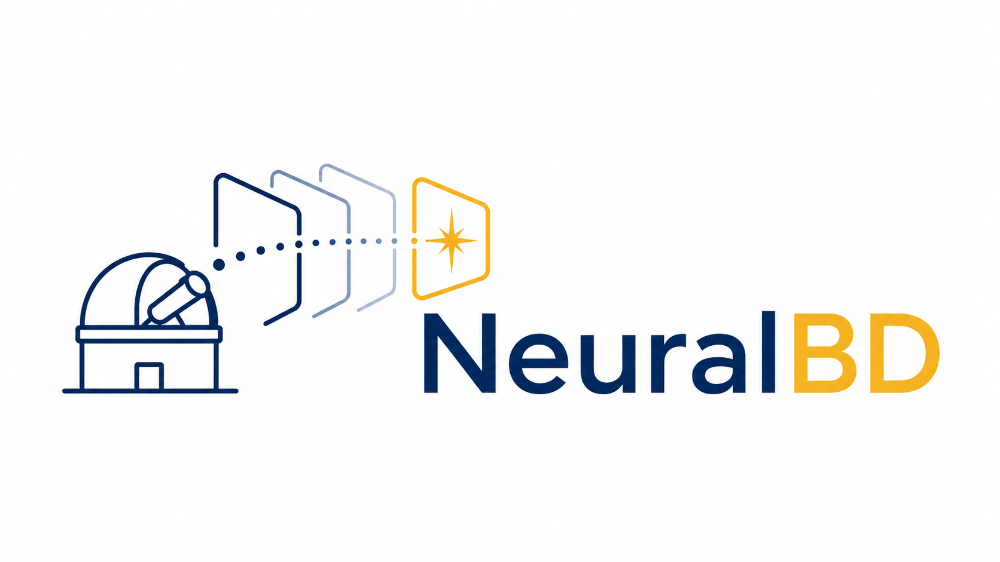

# NeuralBD



NeuralBD is a neural blind deconvolution framework for reconstructing high-resolution solar images from bursts of degraded short-exposure observations. The package jointly learns a sharp latent image and the point spread functions (PSFs) that map that reconstruction back to the observed frames.

The current public interface supports two reconstruction modes:

- **standard NeuralBD**: one learned PSF per burst frame, optionally shared across channels or learned per channel.
- **spatial NeuralBD**: coordinate-conditioned PSFs that vary across the field of view.

NeuralBD uses SIREN models for the latent image and for continuous PSF representations, differentiable convolution for the observation model, Lightning-based training, configurable validation outputs, and a documented data interface for instrument-specific preprocessing.

## Install

```bash
pip install -e ".[dev,docs]"
```

Optional extras are available for documentation, visualization, and FITS input:

```bash
pip install -e ".[docs,viz,io]"
```

## Quick Start

```bash
python examples/create_synthetic_burst.py
nbd-train --config examples/configs/standard_numpy.yaml
nbd-reconstruct --checkpoint runs/standard_numpy/neuralbd.nbd --out reconstruction.npy
```

The example generates a synthetic burst, trains a standard NeuralBD model, saves validation diagnostics, and exports the learned latent reconstruction.

## Workflow

1. Prepare a burst as `(height, width, frames)` or `(height, width, frames, channels)`.
2. Select frames, channels, and optional subframes in the YAML configuration.
3. Choose `method: standard` or `method: spatial`.
4. Configure the PSF representation: direct learned parameters or SIREN-based PSFs.
5. Optionally enable image pretraining and progressive PSF growth.
6. Train with `nbd-train`.
7. Inspect validation figures and export the reconstruction with `nbd-reconstruct`.

## Documentation

The full documentation covers installation, configuration, data conventions, training workflows, method variants, validation outputs, and API references.

## Development Checks

```bash
conda run -n nf2 python -m pytest
conda run -n nf2 ruff check src/neuralbd tests examples docs/conf.py
LC_ALL=C LANG=C MPLCONFIGDIR=/tmp/matplotlib conda run -n nf2 sphinx-build -b html docs docs/_build/html
```
